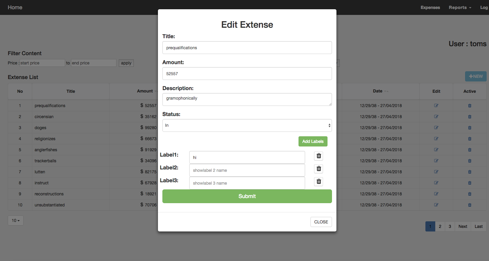

# ExpenseManagementSystem


This is an expense management system which allows you to manage all your incomings and outgoings.
So, user can add his all incoming and outgoings into the system and views the history by category, date/time and etc.

Backend:

* Node.js
* Express.js
* MongoDB

Frontend:

* React.js
* Redux
* Webpack

## Prerequisites

You will need the following resources properly installed on the machine.

* [Git](https://git-scm.com)
* [Node.js](https://nodejs.org) (with NPM)
* [MongoDB](https://www.mongodb.com)

## Getting Started

```bash
# Install the dependencies.
$ cd ./server
$ npm install

# You need to install the dependencies for frontend.
$ cd ./client
$ npm install

# You need to install the dependencies for Unit Test.
$ cd ./test
$ npm install
```


### Run the App

```bash
- Server

$ cd ./server
$ npm start
```
```bash
- Client

$ cd ./client
$ npm start
```
By default, you can visit the API in your web browser at `http://localhost:3001`

And you can access the frontend by visiting [http://localhost:3000](http://localhost:3000)


### Run the Unit Test

```bash
$ cd ./test
$ npm start
```

```bash
$ cd ./test
$ mocha
```

### Project description - Add one or more labels to expenses

https://docs.google.com/document/d/13z4p7Bv332el_vbSuCBVbkOtJ0D-2WpWciiNfw_EnD4/edit?usp=sharing


### Screenshot



